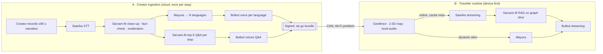

# NAARAD × Sarvam AI — Technical Integration & Token Economics Blueprint

Sep 26, 2026 · @Aryan Mishra

NAARAD runs all four layers of Sarvam's sovereign stack (Saarika, Mayura, Bulbul and Sarvam-M) on every heritage stop it publishes. It spends those tokens once, when a tour is made, then replays the result offline to every traveller on the route. That is how 22-language audio reaches zero-signal rural India on about ₹3.7 of Sarvam spend per monthly active user.

## Executive summary

NAARAD puts all four Sarvam endpoints on its critical path, makes about 0.5 M calls a month at the 50K-MAU SOM, and spends about 95% less than a cloud-render design would.

| What Sarvam evaluates | What NAARAD delivers |
| --- | --- |
| Depth: how much of the stack is used | All four endpoints are on the critical path. Saarika hears creators and travellers. Sarvam-M cleans, moderates, reasons and answers. Mayura carries every story into up to 22 scheduled languages. Bulbul voices each one. No Western model is in the loop. |
| Volume: how usage grows | About 0.5 M Sarvam calls a month at 50K MAU (the deck's SOM) and about 5 M a month at 5 lakh MAU. Usage grows along two axes: catalogue × languages, and MAU × questions. |
| Efficiency: tokens and rupees per unit of value | Offline route bundles cut Sarvam spend by about 95% against rendering every listen in the cloud. Sarvam's tokenizer cuts Indic prompt tokens by 46% blended (56% on Indic text). We plan on Sarvam's conservative 25–40%+ band. |
| Latency | Stop narrations play locally, with no network in the path, under 100 ms after the geofence trigger. The live "Ask NAARAD" loop streams Saarika → Sarvam-M → Bulbul against a \~890 ms first-audio budget. |
| Reach | Each `.tar.gz` route bundle (2.5D vector tiles plus ≤ 90-second Opus audio) is about 8.6 MB per 14-stop route per language. It downloads once over Wi-Fi, so the \~40% of target geographies with poor or no signal are still served. |
| Strategic fit | Every corrected creator transcript and every consented traveller question becomes ground-truth Indic speech and text data: the "vernacular data layer for Bharat". |

## Where each Sarvam endpoint sits

NAARAD has two pipelines. Creator ingestion calls Sarvam once per stop, in the cloud. Traveller runtime runs on the device first and calls Sarvam only for things a bundle cannot hold.



| Endpoint | Creator ingestion (per stop) | Traveller runtime (per session) |
| --- | --- | --- |
| Saarika (STT) | Transcribes the creator's narration (about 75 s average, 90 s cap), with diarisation for multi-voice stories | Streaming transcription of spoken "Ask NAARAD" questions (about 6 s each) over WebSocket |
| Sarvam-M (reasoning) | Clean-up, fact-checks against the Cultural Graph, moderation, titles, summaries, SSML hints. Pre-generates the top-5 traveller Q&A per stop per language. | Answers cache-miss questions using the stop's cultural-graph slice. Answers questions queued offline once the device reconnects. |
| Mayura (translation) | Carries the cleaned script into every enabled language (6, then 12, then 22) | Translates dynamic free-text alerts (closures, weather) for non-English users |
| Bulbul (TTS) | Voices each translated narration (the Creator Studio AI-voice option) and the pre-generated Q&A answers | Streams voiced answers and dynamic alerts |

Model routing. Sarvam has since released Sarvam-30B and Sarvam-105B (open weights, MoE, a tokenizer covering 22 languages in 12 scripts) and has signalled Sarvam-M's deprecation. Here "Sarvam-M" means the reasoning tier, routed by job:

- Live Q&A → the fastest tier: Sarvam-M today, Sarvam-30B (32K context) as it is promoted.
- Batch creation (fact-checking, narrative fusion, Q&A generation) → the deepest tier: Sarvam-105B (128K context). Latency does not matter there, and quality compounds across every future listen.

## API consumption model

At the 50K-MAU SOM, NAARAD makes about 5.06 lakh Sarvam calls a month, which is about ₹1.88 lakh or ₹3.76 per MAU. All figures come from `docs/sarvam/consumption_model.py` in the NAARAD repo.

### Assumptions

| Driver | Pilot (Q4 2026) | SOM: TN + KA | Scale: 10 states | Basis |
| --- | --- | --- | --- | --- |
| Monthly active users | 5,000 | 50,000 | 5,00,000 | Deck SOM = 50K MAU; \~800 users at the IIT Madras Paradox pilot |
| Enabled languages | 6 | 12 | 22 | Deck target: 22 scheduled languages |
| New stops published / month | 120 | 600 | 3,000 | Thanjavur + Auroville, then state circuits |
| Sessions / MAU / month | 1.5 | 1.5 | 1.5 | Tourist cadence |
| Sessions with signal | 60% | 60% | 60% | Deck: \~40% of rural targets have poor signal |
| Voice questions / online session | 3 | 3 | 3 | "Ask NAARAD" at stops |
| Queued questions / offline session | 1 | 1 | 1 | Answered as text on reconnect |
| Answered from the bundle's Q&A cache | 45% | 45% | 45% | Top-5 pre-generated answers per stop |
| Non-English users | 70% | 70% | 70% | Domestic Gen-Z / millennial persona |

Per-call shapes: a stop script is about 180 words (about 1,100 characters per language). A live question is 6 s of audio, 2,000 input tokens (1,400 of them a cacheable prefix) and 120 output tokens, with a 300-character spoken answer. Rates are Sarvam's indicative list prices: Saarika ₹30 per audio hour; Mayura ₹20 and Bulbul v3 ₹30 per 10K characters; the reasoning tier ₹29.28 in, ₹10.98 cached, ₹73.20 out per 1M tokens.

### Creation side: one-time cost per stop

| Languages | Saarika | Sarvam-M | Mayura | Bulbul | Total per stop | 14-stop tour |
| --- | --- | --- | --- | --- | --- | --- |
| 6 | ₹0.62 | ₹0.85 | ₹11.00 | ₹34.50 | ₹46.97 | ₹658 |
| 12 | ₹0.62 | ₹1.60 | ₹24.20 | ₹72.30 | ₹98.73 | ₹1,382 |
| 22 | ₹0.62 | ₹2.87 | ₹46.20 | ₹135 | ₹185 | ₹2,590 |

A full 14-stop tour in all 22 languages, with AI voices and an offline Q&A layer, costs about ₹2,600 in Sarvam compute. That is under 1% of the ₹3–5 lakh B2G fee a tourism board pays to digitise a circuit.

### Monthly endpoint calls

| Scenario | MAU | Saarika | Mayura | Bulbul | Sarvam-M | Total calls / month |
| --- | --- | --- | --- | --- | --- | --- |
| Pilot | 5,000 | 16,620 | 3,750 | 16,125 | 14,145 | 50,640 |
| SOM: TN + KA | 50,000 | 1,65,600 | 38,100 | 1,61,850 | 1,40,850 | 5,06,400 |
| Scale: 10 states | 5,00,000 | 16,53,000 | 3,78,000 | 15,85,500 | 13,75,500 | 49,92,000 |

At SOM that is 269 M Sarvam-M tokens and 288 hours of Saarika audio a month. At scale it is 2.6 B tokens and 2,812 hours.

### Monthly Sarvam spend

| Scenario | Saarika | Mayura | Bulbul | Sarvam-M | Total / month | Per MAU | Naive cloud-render | Saving |
| --- | --- | --- | --- | --- | --- | --- | --- | --- |
| Pilot | ₹900 | ₹2,895 | ₹14,198 | ₹536 | ₹18,529 | ₹3.71 | ₹3,68,323 | 95% |
| SOM: TN + KA | ₹8,625 | ₹30,270 | ₹1,43,955 | ₹5,312 | ₹1,88,162 | ₹3.76 | ₹36,86,534 | 95% |
| Scale: 10 states | ₹84,375 | ₹2,96,100 | ₹14,11,650 | ₹52,095 | ₹18,44,220 | ₹3.69 | ₹3,68,30,845 | 95% |

"Naive cloud-render" is the same product built the usual way. Every non-English stop listen is translated and voiced live, and every question goes to the LLM and is voiced live. About 30% of spend is catalogue creation and 70% is traveller runtime. Bulbul is about 75% of spend, because voice is the product.

### Sensitivity at SOM (50K MAU)

| Lever | Per MAU | Monthly spend |
| --- | --- | --- |
| Base case | ₹3.76 | ₹1.88 L |
| Q&A cache hit rises to 60% | ₹3.38 | ₹1.69 L |
| Q&A cache hit falls to 30% | ₹4.14 | ₹2.07 L |
| Spoken answers capped at 200 characters | ₹3.32 | ₹1.66 L |
| Cache hit 60% and 200-character answers | ₹3.06 | ₹1.53 L |
| Heavy use: 5 questions per online session | ₹4.79 | ₹2.39 L |
| Better coverage: 80% of sessions online | ₹4.58 | ₹2.29 L |
| All 22 languages enabled at SOM | ₹4.80 | ₹2.40 L |
| TTS at a Bulbul-v2-class rate (₹15 per 10K characters) | ₹2.32 | ₹1.16 L |

Budget check: the deck sets Server/Tech at 8% of revenue, about ₹4 per user. The base case fits, but only just, so cache-hit rate and answer length are tracked as product KPIs. Better connectivity and heavier engagement raise Sarvam consumption, so spend grows with value delivered, not with waste.

## Token & latency efficiency

Sarvam's tokenizer cuts NAARAD's Indic prompt tokens by about 46%, and local playback plus streaming keeps every audio path under one second.

### Tokenizer fertility

NAARAD prompts are mostly Indic text: dialect transcripts, Cultural Graph entities in native script, and questions in Tamil, Kannada or Hindi. Tokens per word therefore set the compute bill directly.

| Measure | Sarvam tokenizer | Western (Llama-3.1-class) on Indic |
| --- | --- | --- |
| Tokens per Indic word | 1.4–2.1 (Sarvam-1, published) | 4–8 (Sarvam's published comparison) |
| One 180-word stop script | \~315 tokens | \~720 tokens (at a conservative 4.0) |
| Reduction on Indic text | 56% | — |
| Reduction on an "Ask NAARAD" prompt (40% English, 60% Indic) | 46% | — |

Our arithmetic gives 46% blended, but we plan on Sarvam's 25–40%+ compute-saving band, because real prompts mix scripts in ways a two-bucket model misses. The Sarvam-30B/105B tokenizer extends these gains to Odia, Santali and Meitei, which cover the Konark, Santhal Pargana and Manipur circuits on our roadmap.

What lower fertility buys in practice:

1. Cheaper prompts: input spend falls about in step with token count.
2. Faster answers: a 120-token Sarvam answer carries the same Tamil sentence as about 275 Western tokens, so there are about 2.3× fewer decode steps before Bulbul speaks the last word.
3. More context per window: a stop's whole Cultural Graph slice fits in about 1,400 tokens. That is a cacheable prefix, billed at ₹10.98 instead of ₹29.28 per 1M tokens on every question at that stop.
4. A path to on-device: Sarvam-1 is a 2B model with low fertility, so an offline fallback model on mid-range Android phones is realistic.

### Latency budget

Stop narrations never wait on the network. The geofence engine runs on local GNSS and the audio chunk is already on the phone, so trigger to first audio takes under 100 ms, with or without signal.

The live "Ask NAARAD" voice loop is the only real-time Sarvam path, and each stage streams into the next:

| Stage | Budget (p50 target) | How |
| --- | --- | --- |
| End-of-speech detection | 150 ms | On-device VAD |
| Saarika final transcript | 150 ms | WebSocket streaming; partials arrive while the user speaks, so only the tail is finalised |
| Retrieval | 20 ms | Cultural-graph slice is local, shipped in the bundle |
| Sarvam-M time-to-first-token | 250 ms | Cached \~1,400-token prefix; speculative start on a stable partial transcript |
| First clause (\~12 tokens) | 100 ms | Fewer tokens per clause |
| Bulbul time-to-first-byte | 180 ms | WebSocket streaming; Sarvam publishes under 200–250 ms |
| Playback buffer | 40 ms | Opus jitter buffer |
| First audio heard | ≈ 890 ms | Sub-second, with overlapping stages |

These are engineering targets, to be measured in the pilot against a 1.2 s p95 ceiling. A Q&A cache hit plays local audio in under 150 ms. If the network drops mid-answer, the app plays an earcon, finishes from the text already received, and moves the question to the offline queue.

## Offline-first architecture

NAARAD spends tokens once in the cloud and replays them for free on the edge. One signed `.tar.gz` of about 8.6 MB holds everything needed to walk a route with zero signal.

### Route bundle format

```
naarad-hampi-vijayanagara-circuit.ta.v7.tar.gz
├── manifest.json               # route id, version, language, bbox, expiry, sha256 per file, ed25519 signature
├── map/
│   ├── tiles/{z}/{x}/{y}.mvt   # 2.5D vector tiles, z12–z17 (footprints + height attribute)
│   └── style.json              # extrusion + high-contrast WCAG style
├── route/
│   ├── path.geojson            # primary walk
│   ├── geofences.geojson       # per-stop radius/polygon, dwell time, approach heading
│   └── alt-routes.json         # pre-computed Tier-1 → Tier-2 nudge alternatives
├── audio/
│   ├── stop-01.ta.opus         # ≤ 90 s, 24 kbps mono Opus ≈ 270 KB
│   ├── qa/stop-01-q1.ta.opus   # pre-voiced answers to the top-5 questions
│   └── nudges/*.ta.opus        # templated crowd / detour prompts
├── text/
│   ├── transcripts.ta.json     # captions + search
│   └── qa-cache.ta.json        # question embeddings + answers for on-device matching
├── graph/cultural-graph.json   # entity slice for local retrieval and the online LLM prefix
└── quests/quests.json          # scavenger hunts, Yatra-credit prices per POI tier
```

- 2.5D vectors, not raster. Vector tiles with a height attribute are extruded on the device into the deck's 2.5D view. They are about 5–10× smaller than raster, can be restyled offline, and the route optimiser can compute on them without a server.
- 90-second chunks. The cap exists for attention, and it also fixes the storage budget. At 24 kbps mono Opus, which is transparent for speech, one chunk is at most 270 KB.

### Size & bandwidth

| Component (14 stops, 1 language) | Size |
| --- | --- |
| Stop audio (14 × 90 s × 24 kbps, worst case) | 3.7 MB |
| 2.5D vector tiles, z12–z17, \~8 km corridor | \~4.5 MB |
| Geofences, graph, Q&A text, quests, manifest | \~0.4 MB |
| Bundle total | ≈ 8.6 MB |

Each extra language adds about 4 MB, because tiles are shared through a language-neutral base bundle. Streaming the same walk (64 kbps AAC, raster tiles, retries on 2G/3G) moves roughly 20–40 MB over cellular, and often fails at exactly the rural sites we serve. The bundle moves 8.6 MB once, over Wi-Fi, then 0 bytes per replay. A live question costs about 18 KB up and 60 KB down.

### Bundle lifecycle

1. Build: a creator publishes or edits a stop, the Sarvam creation pipeline runs, and the builder hashes each file and signs the manifest.
2. Distribute: immutable, versioned objects on an India-region CDN. This is the offline-first infrastructure behind the deck's 70% server saving.
3. Prefetch: download on Wi-Fi when a trip is planned, when a District Pass is bought, or from a QR code at an ASI monument. Downloads resume with HTTP range requests.
4. Update: delta by sha256, so a fixed typo in one stop re-downloads 270 KB, not the route.
5. Play: geofence, map, narration, Q&A cache and quests all run with zero network.
6. Sync: on reconnect, the app sends signed listen receipts (for per-listen UPI creator payouts), Yatra-credit debits and queued questions.

### What works with zero signal

| Capability | Online | Zero signal |
| --- | --- | --- |
| Map, route, 2.5D view | Yes | Yes, from bundle tiles |
| Geofence-triggered stop audio | Yes | Yes, local, under 100 ms |
| Captions, language switch | Yes | Yes, for every language downloaded |
| Crowd-aware nudge to Tier-2 sites | Live crowd data | Pre-computed alternatives with time-of-day priors |
| "Ask NAARAD" questions | Streaming Saarika → Sarvam-M → Bulbul | Q&A cache match (45% target); a miss is queued and answered as text on reconnect |
| Yatra-credit payment | Live | Pre-trip escrow and local debits, settled by UPI auto-top-up afterwards |
| Creator listen accounting | Live | Signed receipts, stored and forwarded |

Queued misses show which questions travellers actually ask at each stop. They go to creators and into the next bundle build, which raises the cache-hit rate, the largest cost lever after TTS pricing.

## Sovereignty, compliance & the data flywheel

No traveller audio leaves India, and every published stop becomes a verified Indic speech–text pair that NAARAD can share with Sarvam.

- Sovereign by construction: speech, text, reasoning and voice all run on Sarvam's India-hosted stack, and bundles are served from India-region storage.
- DPDP Act 2023: traveller questions are processed transiently by default. Keeping them needs explicit, revocable opt-in and is anonymised, with no device id and no location finer than the stop. Creator recordings are licensed under the creator agreement, with the revenue share preserved.
- Hallucination and moderation control (a risk named in the deck): Sarvam-M fact-checks each script against the Cultural Graph at build time. Low-confidence claims go to heritage editors before publishing. Live answers are grounded only in the stop's graph slice and must cite it.
- Relationship with Bhashini: Sarvam becomes the primary inference stack. Bhashini stays for government dataset-contribution commitments and as a fallback for dialects outside Sarvam's coverage.

The flywheel: each stop yields a dialect-tagged, geo-anchored pair of creator audio and a human-corrected transcript, plus editor-reviewed translations. We propose a data partnership, under a separate agreement and with creator consent, for evaluation and fine-tuning on heritage-route dialects such as Kongu Tamil, Tulu, Kodava and Sourashtra.

## Pilot KPIs & asks of Sarvam

Sarvam can hold NAARAD to eight measurable pilot targets. In return we ask for credits, headroom and TTS pricing sized to the Pilot row.

| KPI | Pilot target | Why it matters |
| --- | --- | --- |
| Sarvam endpoints on the critical path | 4 of 4 | Depth of integration |
| Enabled languages per corridor | 6 or more | Mayura and Bulbul breadth |
| "Ask NAARAD" first-audio latency | p50 under 1.0 s, p95 under 1.2 s | Streaming pipeline quality |
| Geofence trigger to stop audio | Under 100 ms, offline | Offline-first promise |
| Q&A cache hit rate | 45%, rising to 60% | Main runtime efficiency lever |
| Sarvam spend per MAU | ₹4.00 or less | Fit with the 8% tech line |
| Sessions completed with zero signal | Reported separately | Rural reach |
| Creator transcripts human-corrected | 100% before publishing | Data-flywheel quality |

Asks of Sarvam:

1. Pilot credits sized to the Pilot row (about ₹20K a month for 6 months), with headroom for load tests.
2. Rate-limit and concurrency guarantees for festival spikes: Pongal at Thanjavur and Hampi Utsav pack a month of traffic into days.
3. Volume or cached-audio pricing for Bulbul, which is about 75% of our spend. Voicing once and replaying offline is an unusually efficient TTS pattern.
4. Early access to Sarvam-30B/105B streaming endpoints and to any on-device Sarvam-1-class runtime.
5. Joint dialect evaluation, using the NAARAD corpus as a held-out test set.

## Assumptions & sources

The rates, latencies and traffic drivers here are planning figures. The pilot's first job is to replace them with measured values.

- Sarvam rates are indicative public list prices at the time of writing and must be re-confirmed. The model takes a single rates table, so re-pricing takes seconds.
- Latency figures are targets to validate in the pilot. Sarvam's published figures are cited as such.
- Fertility figures are Sarvam's published numbers. The 46% blended figure is our own arithmetic on a representative prompt mix.
- The \~40% poor-signal figure is from the *Naarad Today* deck.

Sources:

- NAARAD, *Naarad Today* and *NAARAD Partner & Creator Deck* (internal)
- [Sarvam API pricing](https://docs.sarvam.ai/api/pricing) · [sarvam.ai/api-pricing](https://www.sarvam.ai/api-pricing)
- [Sarvam-1 announcement](https://www.sarvam.ai/blogs/sarvam-1) · [Sarvam-1 on Hugging Face](https://huggingface.co/sarvamai/sarvam-1)
- [Open-sourcing Sarvam 30B and 105B](https://www.sarvam.ai/blogs/sarvam-30b-105b)
- [Bulbul v3](https://www.sarvam.ai/blogs/bulbul-v3) · [Sarvam TTS API](https://docs.sarvam.ai/api-reference-docs/text-to-speech/api/overview)
- [Saarika model docs](https://docs.sarvam.ai/api-reference-docs/models/saarika) · [Mayura model docs](https://docs.sarvam.ai/api-reference-docs/getting-started/models/mayura)
